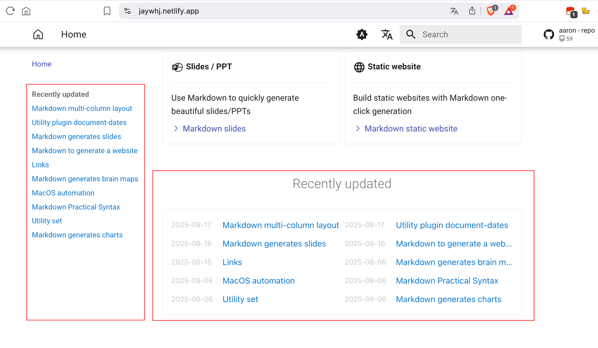
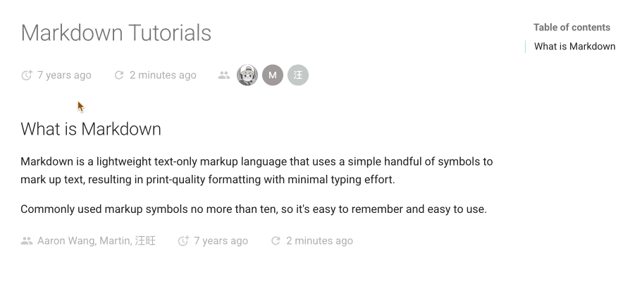

# mkdocs-recently-updated-docs

[English](README.md) | 简体中文


一行代码显示最近更新的文档列表

## 特性

- 支持整体列表显示最近更新的文档
- 灵活的显示位置（`侧边栏` 或 `md文档中`）
- 丰富的模板示例
- 适用于任何环境（no-Git, Git, all CI/CD build systems, etc）

## 预览



## 安装

```bash
pip install mkdocs-recently-updated-docs
```

## 配置

在你的 mkdocs.yml 中添加插件即可：

```yaml
plugins:
  - recently-updated
```

或者，你要个性化配置：

```yaml
plugins:
  - recently-updated:
      limit: 10          # 限制显示的文档数量
      exclude:           # 排除文件列表
        - index.md       # 排除指定文件
        - drafts/*       # 排除 drafts 目录下所有文件，包括子目录
      template: templates/recently_updated_list.html    # 自定义渲染模板
```

## 使用方法

只需在 md 文档中任意位置写下这一行：

```markdown
<!-- RECENTLY_UPDATED_DOCS -->
```

## 自定义模板

请参阅 [templates](https://github.com/jaywhj/mkdocs-recently-updated-docs/tree/main/mkdocs_recently_updated_docs/templates) 目录

<br />

## 其它插件

[mkdocs-document-dates](https://github.com/jaywhj/mkdocs-document-dates)

新一代 MkDocs 插件，用于显示文档的确切**创建时间、上次更新时间、作者、电子邮件**


