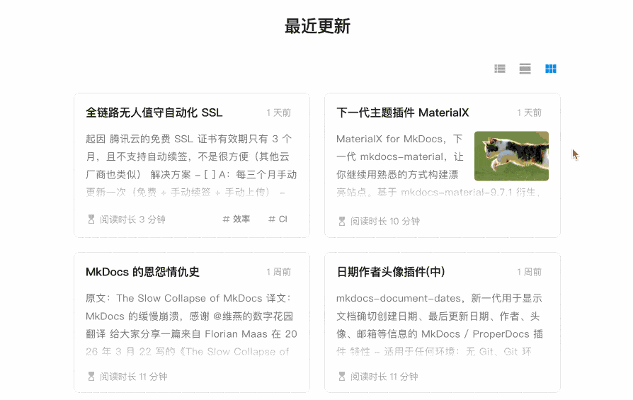

# mkdocs-recently-updated-docs

[English](README.md) | 简体中文

<br />

仅需一行代码，即可在你的 MkDocs 站点的任意位置显示最近更新的文档列表。最新更新模块会以结构化的方式展示站点的文档信息，这非常适合**文档数量众多或更新频繁**的网站，这样读者可以**快速查看最新内容**。

## 特性

- 按更新时间降序显示最近更新的文档，列表项动态更新
- 支持列表、详情、网格等多种视图模式
- 支持自动提取文章摘要
- 支持在 Front Matter 中自定义文章封面
- 支持自定义显示数量
- 支持排除指定文件或目录
- 适用于任何环境（no-Git, Git, Docker, all CI/CD build systems, etc.）

## 预览



## 安装

```bash
pip install mkdocs-recently-updated-docs
```

## 配置

在你的 mkdocs.yml 中添加插件即可：

```yaml
plugins:
  - recently-updated
```

或者，完整配置：

```yaml
plugins:
  - recently-updated:
      limit: 10          # 限制显示的文档数量
      exclude:           # 排除文件列表（支持 unix shell 样式的通配符）
        - index.md       # 排除指定文件
        - '*/index.md'   # 排除所有子目录下的 index.md 文件
        - blog/*         # 排除 blog 目录下所有文件，包括子目录
```

## 使用方法

只需在 md 文档中任意位置写下这一行：

```html
<!-- RECENTLY_UPDATED_DOCS -->
```

## 配置文章封面

在 Front Matter 中使用字段 `cover` 指定文章封面（支持 URL 路径和本地文件路径）：

```yaml
---
cover: assets/cat.jpg
---
```

<br />

## 其他项目

- [**MaterialX**](https://github.com/jaywhj/mkdocs-materialx)，下一代 mkdocs-material，让你继续用熟悉的方式构建漂亮站点。基于 `mkdocs-material-9.7.1` 衍生，取名为 `X`，提供持续的维护与更新（因为 mkdocs-material 将停止维护）  
目前已发布的更新，重构和添加了很多新功能，详情见 https://github.com/jaywhj/mkdocs-materialx/releases/

<br />

- [**mkdocs-document-dates**](https://github.com/jaywhj/mkdocs-document-dates)，新一代 MkDocs 插件，用于显示文档的确切**创建日期、上次更新日期、作者、电子邮件**

  

<br />

## 交流群

**Discord**: https://discord.gg/cvTfge4AUy

**Wechat**: 

